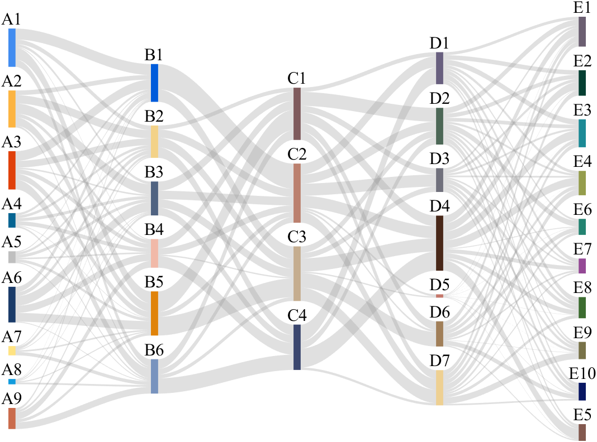
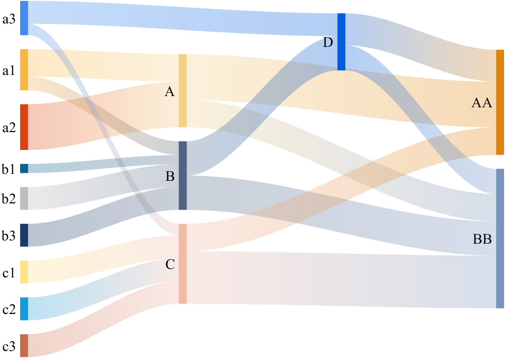
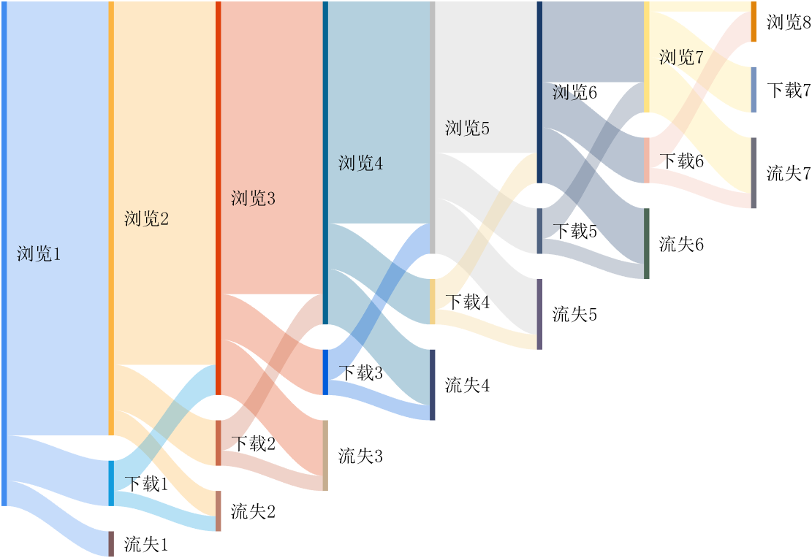
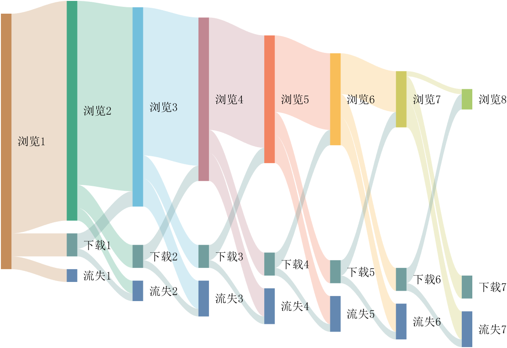
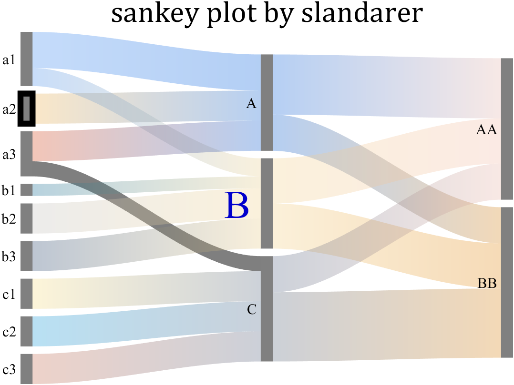
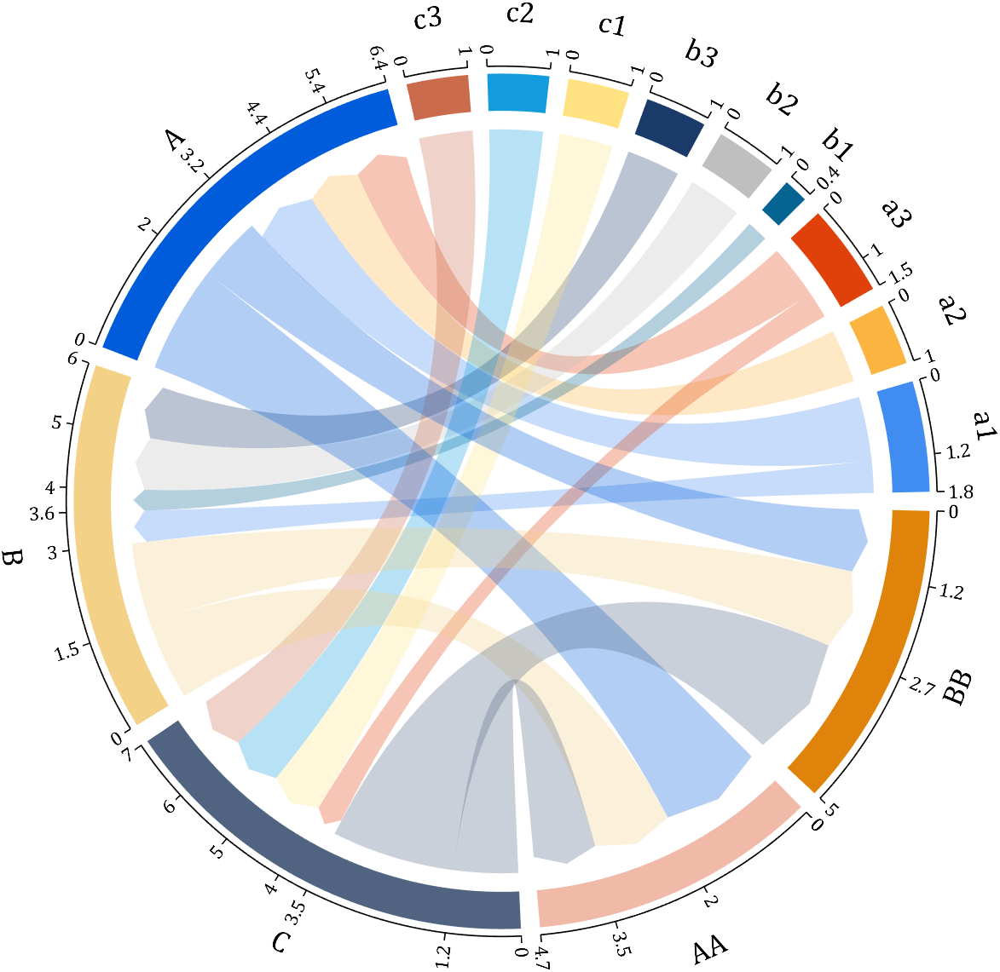

# MATLAB sankey  (桑基图)

sankey plot /sankey diagram /sankey chart

#### mathworks fileexchange 链接(引用格式)
Zhaoxu Liu / slandarer (2023). sankey plot (https://www.mathworks.com/matlabcentral/fileexchange/128679-sankey-plot), MATLAB Central File Exchange. 检索来源 2023/4/28.


#### Visualization result (使用效果)












### Basic usage
```matlab
links={'a1','A',1.2;'a2','A',1;'a1','B',.6;'a3','A',1; 'a3','C',0.5;
    'b1','B',.4; 'b2','B',1;'b3','B',1; 'c1','C',1;
    'c2','C',1;  'c3','C',1;'A','AA',2; 'A','BB',1.2;
    'B','BB',1.5; 'B','AA',1.5; 'C','BB',2.3; 'C','AA',1.2};

% 创建桑基图对象(Create a Sankey diagram object)
SK=SSankey(links(:,1),links(:,2),links(:,3));

% 开始绘图(Start drawing)
SK.draw()
```


### Basic usage - adjMat
```matlab
% Define inter-layer adjacency matrices
% 定义层间邻接矩阵
A12 = [1,2,1; 1,2,3; 2,0,1];
A23 = [1,4; 2,1; 0,3];
A34 = [1,5; 2,3];

% Assemble global block matrix (main diagonal = zero, super-diagonal = A12, A23, A34)
% 组装全局分块矩阵（主对角线为零，上对角线为 A12, A23, A34）
adjMat = mergeAdjMat({A12, A23, A34});

SK = SSankey([],[],[], 'AdjMat',adjMat);
SK.draw()
```


### Add nodes
```matlab
adjMat=[0,0,0,1,2,1,0,0,0,0;
        0,0,0,1,2,3,0,0,0,0;
        0,0,0,2,0,1,0,0,0,0;
        0,0,0,0,0,0,1,4,0,0;
        0,0,0,0,0,0,2,1,0,0;
        0,0,0,0,0,0,0,3,0,0;
        0,0,0,0,0,0,0,0,1,5;
        0,0,0,0,0,0,0,0,2,3;
        0,0,0,0,0,0,0,0,0,0;
        0,0,0,0,0,0,0,0,0,0];

nodeList=compose('C%d',1:10);

% 创建桑基图对象(Create a Sankey diagram object)

SK=SSankey([],[],[],'NodeList',nodeList,'AdjMat',adjMat);

% add node to sankey diagram 
% try : obj.addNode(name,layer)
SK.addNode('Add1',3)
SK.addNode('Add2')
SK.addNode()

% 开始绘图(Start drawing)
SK.draw()
SK.addNode('Add3',5)
```


### Add links
```matlab
adjMat=[0,0,0,1,2,1,0,0,0,0;
        0,0,0,1,2,3,0,0,0,0;
        0,0,0,2,0,1,0,0,0,0;
        0,0,0,0,0,0,1,4,0,0;
        0,0,0,0,0,0,2,1,0,0;
        0,0,0,0,0,0,0,3,0,0;
        0,0,0,0,0,0,0,0,1,5;
        0,0,0,0,0,0,0,0,2,3;
        0,0,0,0,0,0,0,0,0,0;
        0,0,0,0,0,0,0,0,0,0];

nodeList=compose('C%d',1:10);

% 创建桑基图对象(Create a Sankey diagram object)

SK=SSankey([],[],[],'NodeList',nodeList,'AdjMat',adjMat);

SK.addNode('Add1',3)
SK.addNode('Add2')
SK.addNode('Add2',5)
% add link to sankey diagram 
% try : obj.addLink(source,target,value)
SK.addLink(5,11,3)

% 开始绘图(Start drawing)
SK.draw()
SK.addLink(7,12,3)
SK.addLink(11,12,3)
SK.addLink(10,13,3)
SK.addLink(12,13,6)
```


### See demos for more examples.